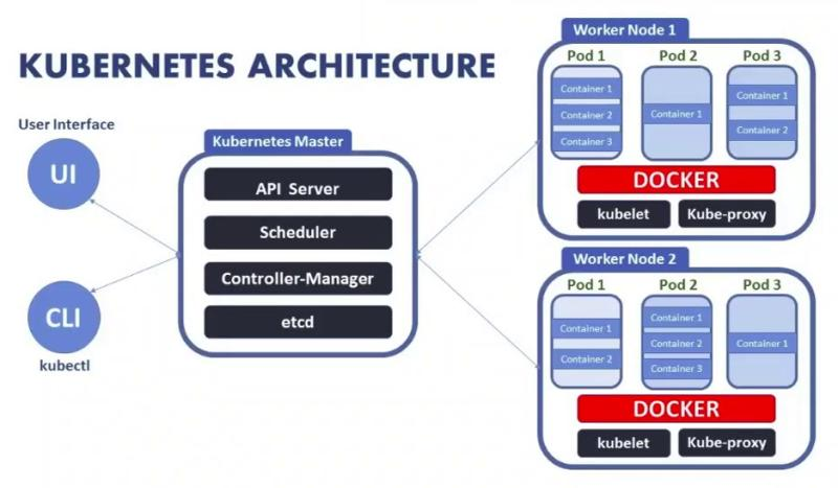
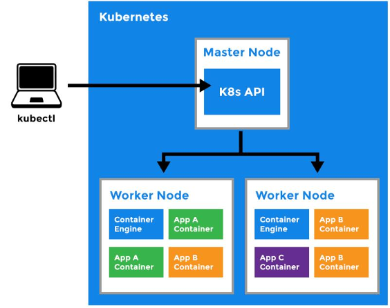

# 1. Arquitectura
---

Contenerizar, es una técnica se que usa en varias aplicaciones y distintos ambientes, te permite hacer seguimiento de tus contenedores para planificarlos, administrarlos y orquestarlos, es ahí donde Kubernetes toma relevancia. 
Kubernetes es una especie de arquitectura "esclavo-maestro":

- Nodo Maestro: 
  - Controla los nodos
  - Corre el API de Kubernetes, el cual es el acceso a las tareas de administración
  - Orquesta la los nodos esclavos

- Nodos Esclavos:
  - Es una maquina de procesamiento de tareas
  - Es una maquina que ejecutará procesos que el maestro le solicite
  - Corre contenedores  dentro de los pods
  - Aquí corre un docker engine que ejecuta contenedores y administra su ciclo de vida

Recuerden que la arquitectura es muy importante, si no se tienen las bases es más dificil entender el funcionamiento. 

Inicialmente, en el master tenermos el API de Kubernetes mediante un CLI, en este caso usaremos Kube Control (kubectl) mediante operaciones imperativas pre-fabricadas, e inclusive podemos hacer llamados a la API de Kubernetes con json request!. Una vez que la API lo procesa, se encarga de distribuir nuestras peticiones a los nodos de trabajo.

###  Kube Scheduler
Cuando le digo, API, quiero crear una aplicación nginx, el API de kubernetes le va a decir a nuestro programador:
"Necesito que generes una instancia de esta aplicación en uno de tus nodos que tengan posibilidad de ejecutarlos, bajo las especificaciones que han especificado".

Entonces Kubernetes busca el nodo con mejores posibilidades de ejecutar esta aplicación, sí no hay nodos disponibles, el scheduler dejará esta aplicación en estado pendiente hasta que las maquinas que tengo bajo mi cargo no tienen la configuración necesaria para ejecutar esta aplicación.

Grosso modo, Scheduler se va a encargar de colocar las aplicaciones en el nodo adecuado para su ejecución.

###  Kube Controller

#### Node Controller

El controlador de nodos es un componente del plano de control de Kubernetes que gestiona varios aspectos de los nodos.

El controlador de nodo tiene múltiples roles en la vida de un nodo. El primero es asignar un bloque CIDR al nodo cuando está registrado (si la asignación CIDR está activada).

El segundo es mantener actualizada la lista interna de nodos del controlador de nodos con la lista de máquinas disponibles del proveedor de la nube.

El tercero es monitorear la salud de los nodos. El controlador de nodo es responsable de:

- Actualización de la condición NodeReady de NodeStatus a ConditionUnknown cuando un nodo se vuelve inaccesible, ya que el controlador del nodo deja de recibir latidos por algún motivo, como que el nodo está inactivo.
- Desalojar todos los pods del nodo mediante una terminación ordenada si el nodo sigue siendo inalcanzable. Los tiempos de espera predeterminados son 40 segundos para comenzar a informar ConditionUnknown y 5 minutos después para comenzar a desalojar los pods.

#### Replication Controller
Mantiene las réplicas de una aplicación dentro del cluster
#### Endpoint Controller
Servicios y pods a nivel de redes
#### Service Y token controller 
Autenticación cuando hagamos llamadas a la API

### ETCD

Es una base de datos (llave-valor), que almacena el estado de la configuración del cluster, En este caso nos ayuda en algo que se llama Estado Actual y Estado deseado!
Entonces cuando un valor cambia en ETC, se hace una comparación, y se pregunta Kubernetes ¿Cual es el estado actual?, ¿Este coincide con el estado deseado?, sí no es así se comienza a ejecutar un rolling para que siempre se mantenga la configuración almacenada publicada.

### Kubelet

Kubelet es el agente del cluster kubernetes, es un servicio que corre en todos los nodos workers,  este servicio es responsable de:
- Recibir información y enviar información hacia el master
- Kubelet envía estadísticas de uso de los nodos al master

### Kube Proxy
Kube proxy corre en cada nodo, el se encarga de los temas de red, entonces el se encarga de hacer que los pods se comuniquen dentro del cluster.

### Container Runtime
El runtime que se requiere para operar los contenedores, en este caso usaremos Docker!!

