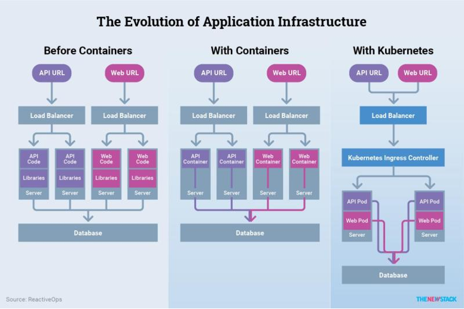
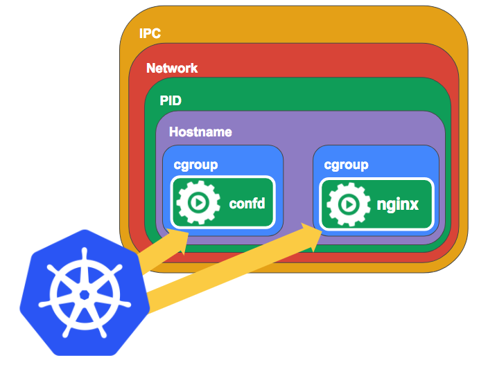

# Contenedores
----

Un **Contenedor** es un proceso que se ejecuta de manera aislada en lo que se llaman un *namespace*, pero dentre del el corren algunos espacios de nombres importantes que mencionaremos:

- **IPC**: Intern Process Comunnication, La comunicación entre procesos (comúnmente IPC, del inglés Inter-Process Communication) es una función básica de los sistemas operativos. Los procesos pueden comunicarse entre sí a través de compartir espacios de memoria, ya sean variables compartidas o buffers, o a través de las herramientas provistas por las rutinas de IPC. La IPC provee un mecanismo que permite a los procesos comunicarse y sincronizarse entre sí, normalmente a través de un sistema de bajo nivel de paso de mensajes que ofrece la red subyacente.

- Cgroup: Es la manera que tenemos para controlar el consumo de  recursos que requiere un contenedor (RAM, CPU)

- **Network**: Cada contenedor crea su propio namespace de network, cada contenedor tiene su propia red y sólo puede ver los procesos que están dentro de esta red y estos están encerrados dentro del contenedor.

- Mount:  Nos permiten montar sistemas de archivos externos (NFS, Gluster, etc ), cada contenedor se crea con su propio mount 

- PID: Es el ID que le da los procesos corriendo dentro del contenedor 

- User: Cada contenedor tiene sus grupos y usuarios aislados

- **UTS** - Unix Timesharing System: Nos da la habilidad de darle un hostname a cada contenedor

Un contenedor comprende las características únicas mencionados, cada contenedor puede comunicarse con sus procesos, tiene su propia red, sus puntos de montaje, sus propios PIDS y USERS, así como hereda un hostname único.
## Pods
Inicialmente teníamos un LXC ( Linux Containers), cada contenedor es un LXC con las características antes mencionadas, el tema de compartir procesos y red entre contenedores era muy complicado con LXC, lo que hizo docker fue simplificar la comunicación entre contenedores. Docker habilita la red Bridge para que entre contenedores puedan comunicarse entre contenedores. 

Kubernetes lo que hace es compartir el IPC, Network,  UTS, para generar un pod, kubernetes crea un contenedor dummy para crear otro pod, adquiere el IPC y Network! entonces los contenedores dentro de un pod tendrán las mismas IPs, y ahora pueden comunicarse entre procesos. 

# Creando Pods 

`$ kubectl get pod `
`$ kubectl run --generator=run-pod/v1 podtest --image=nginx:alpine `

o bien

`kubectl run  prueba --image=nginx:alpine`

# Detallando mas los pods 
`$ kubectl get pod -o wide`

# Revisando el estado de un pod 
`$ kubectl describe pod <NOMBRE_DEL_POD>`

# Eliminar un pod 
`$ kubectl delete  pod <NOMBRE_DEL_POD>`

# Obtener mas información de  un pod

`kubectl get pod -o wide`

`kubectl get pod -o yaml`

# Entra a un pod 
`kubectl exec -it <NOMBRE_DEL_POD> -- sh`

# Obtiene los logs de un pod 

`kubectl logs  <NOMBRE_DEL_POD>`

`kubectl logs  <NOMBRE_DEL_POD> -f`