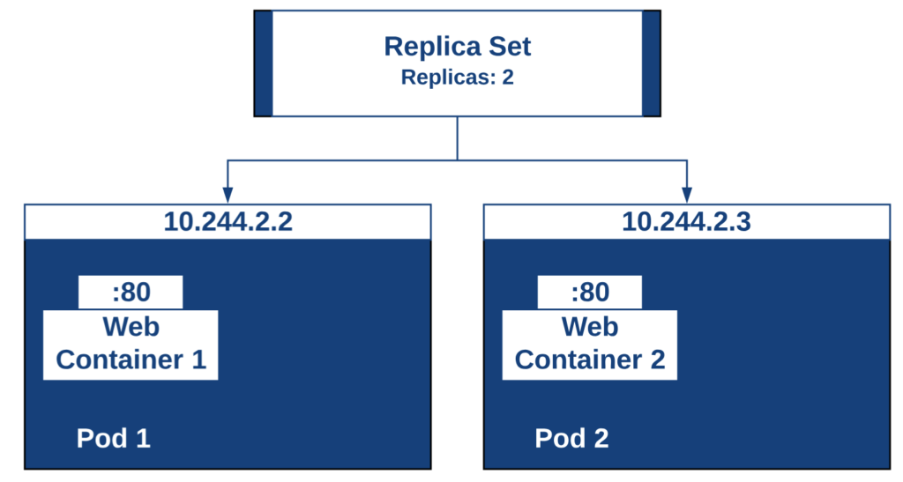

# ReplicaSet


El propósito de un ReplicaSet es mantener un conjunto estable de Pods de réplica ejecutándose en cualquier momento. Como tal, a menudo se usa para garantizar la disponibilidad de un número específico de Pods idénticos.

Un ReplicaSet se define con campos, incluido un selector que especifica cómo identificar los pods que puede adquirir, una cantidad de réplicas que indica cuántos pods debe mantener y una plantilla de pod que especifica los datos de los nuevos pods que debe crear para cumplir con el número de criterios de réplicas.




```yaml
apiVersion: apps/v1
kind: ReplicaSet
metadata:
  name: replicasettest
  labels:
    app: replicasettest
spec:
  replicas: 3
  selector:
    matchLabels:
      app: front
  template:
    metadata: 
      labels:
        app: front
    spec:
      containers:
      - name: server
        image: nginx:alpine

```
### obtiene un replicaset
`kubect get rs`
`kubect get rs -o yaml`

### Un pod le pertenece a un replica (Owner reference)
kubect get pod <nombre> -o yaml 