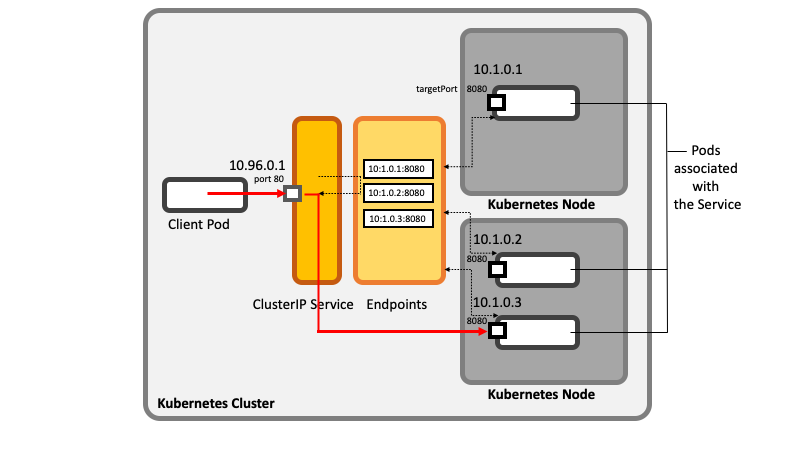

# Servicios 

Un servicio Kubernetes es un conjunto de pods que trabajan en conjunto, como una capa de una aplicación multicapas. El conjunto de pods que constituyen un servicio está definido por el selector de etiquetas​. Kubernetes provee de un servicio de descubrimiento y enrutamiento de pedidos mediante la asignación de una dirección IP estable y un nombre DNS al servicio, y balancea la carga de tráfico en un estilo round-robin hacia las conexiones de red de las direcciones IP entre los pods que verifican el selector (incluso cuando fallas causan que los pods se muevan de máquina en máquina). Por defecto un servicio es expuesto dentro de un cluster (por ejemplo, pods de un back end pueden ser agrupados en un servicio, con las peticiones de los pods de front end siendo balanceadas entre ellos), pero un servicio también puede ser expuesto hacia afuera del clúster.



```yml
apiVersion: apps/v1
kind: Deployment
metadata:
  name: servers
  labels:
    app: front
spec:
  replicas: 3
  selector:
    matchLabels:
      app: front
  template:
    metadata:
      labels:
        app: front
    spec:
      containers:
      - name: nginx
        image: nginx:alpine
---        
apiVersion: v1
kind: Service
metadata:
  name: servers
  labels:
    app: front
spec:
  selector:
    app: front
  ports:
    - protocol: TCP
      port: 8080
      targetPort: 80
```

`kubectl get service -l app=front`

`kubectl describe service servers`

`kubectl get pod -l app=front -o wide`