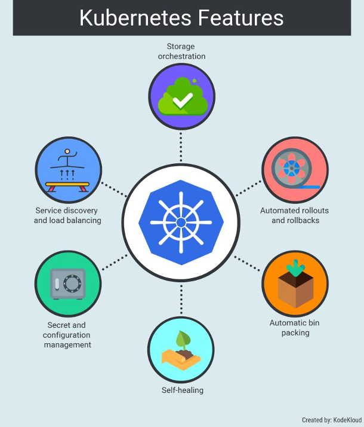

# Kubernetes (K8s)
---
- [Arquitectura](1-arquitectura.md)
- [Instalación](2-instalacion.md)
- [Contenedores](3-contenedores.md)
- [Replica Set](4-replicaset.md)
- [Deployments](5-deployments.md)
- [Rollings](6-rollings.md)
- [Límites](7-limites.md)
- [Health](8-health.md)
- [ConfigMaps](9-configmaps.md)
- [Secrets](10-secrets.md)
- [Volumes](11-columes.md)
- [Accesos](12-accesos.md)
- [Ingress](13-ingress.md)

## ¿Qué es?
Kubernetes, también conocido como K8s, es un sistema de código abierto para automatizar la implementación, el escalado y la administración de aplicaciones en contenedores.

En Kubernetes, hay un nodo maestro y varios nodos workers, cada nodo worker puede manejar varios pods.
Los pods son unidades almacenadoras de contenedores agrupados como una unidad de trabajo, en un pod estará ejecutándose una aplcación diseñada para ejecutarse en un contenedor mediante unas definiciones que son enviadas a un nodo maestro a través de la API de Kubernetes. 
Una vez que la especificación de la aplicación es leída, la cual está realizada en un archivo yaml,  kubernetes toma control de la aplicación, despliega el aplicativo y sí llegara a fallar Kubernetes intentará reiniciarlo tantas veces como sea posible hasta que se estabilice la operación o bien, no se pueda hacer más y se declarará una operación fallida.

Esto hace que el proceso de administrar contenedores sea simple, es facir construir y agregar nuevas características así como mejorar una aplicación para obtener una mayor satistacción del usuario final.

## Ejemplos de Uso

- [Domino's Pizza](https://cloud.google.com/customers/dominos): Domino's tiene la intención de crear un nuevo valor comercial y acelerar su lanzamiento al mercado reescribiendo las aplicaciones centrales para que se ejecuten como microservicios. Los equipos de Dominos están modernizando estas aplicaciones centrales internamente con microservicios, pero cada equipo usa una plataforma diferente. Los equipos internos eligieron una plataforma de distribución de Kubernetes integral y de grado de producción con funciones de seguridad empresarial y soporte completo para la gestión del ciclo de vida, y con Kubernetes, Domino's está evaluando la viabilidad y el nivel de esfuerzo para convertir los sistemas y procesos actuales en una arquitectura basada en contenedores.
  
- [Bose](https://www.cncf.io/blog/2019/05/07/bose-supports-rapid-development-for-millions-of-iot-products-with-kubernetes/); Bose ha sido un actor importante en la integración de  dispositivos de IoT y sistemas de audio durante varios años. El equipo de liderazgo de ingeniería de Bose siempre quiso pasar a una arquitectura de microservicios.
Cuando la demanda comenzó a crecer, tuvieron que buscar una solución que pudiera ayudar a su equipo de plataforma de ingeniería a implementar servicios en producción rápidamente sin problemas. Para esto, evaluaron y encontraron muchas plataformas alternativas, pero finalmente eligieron Kubernetes debido a su plataforma como servicio de IoT escalada que se ejecuta en AWS.

- Game of Thrones: Los ingenieros comenzaron a entrar en pánico porque sabían que el tráfico impredecible para el estreno más esperado de la séptima temporada de Game of Thrones será ENORME. Uno de los desafíos que descubrieron fue la infrautilización de los recursos desplegados. El código de Node.js tiende a usar solo un núcleo de CPU. Las instancias de AWS EC2 que tenían excelentes capacidades de red tendían a basarse en CPU de doble núcleo. Como tal, HBO solo estaba usando el 50 por ciento de la capacidad de CPU en su implementación. La capacidad de poner en marcha nuevas instancias en EC2 no fue tan rápida como lo que necesitaba HBO. HBO también descubrió que en momentos de máxima demanda de Game of Thrones, también se estaban quedando sin direcciones IP disponibles para ayudar a entregar el contenido a los espectadores.

- Pokemon Go:  Niantic eligió GKE por su capacidad para organizar su clúster de contenedores en escalas impresionantemente grandes, lo que liberó a su equipo para que se concentrara en implementar cambios en vivo para sus jugadores. De esta forma, Niantic utilizó Google Cloud para convertir Pokémon GO en un servicio para millones de jugadores, adaptándose y mejorando continuamente. Esto les dio más tiempo para concentrarse en construir la lógica de la aplicación del juego y las nuevas funciones en lugar de preocuparse por la parte de escalado.

## ¿Qué nos ofrece K8s?
- Automatic binpacking: Aquí es donde Kubernetes ayuda a colocar contenedores automáticamente según sus especificaciones (requisitos de recursos, límites y otras restricciones), sin comprometer la disponibilidad.
- Service Discovery: En palabras simples, el descubrimiento de servicios es el proceso de averiguar cómo conectarse a un servicio.
- Self-healing: Reinicia los contenedores que fallan, reemplaza y reprograma los contenedores cuando los nodos mueren.
- Secret and configuration management: Kubernetes tiene un mecanismo integrado para almacenar valores de configuración que preferiría mantener privados. La información confidencial como el nombre de usuario, las contraseñas con cifrado y otras credenciales se puede mantener de forma confidencial.
- Storage Orchestration: K8s automáticamente el sistema de almacenamiento de su elección, ya sea desde el almacenamiento local, un proveedor de nube pública como GCP o AWS, o un sistema de almacenamiento en red como NFS, iSCSI, Gluster, Ceph, Cinder o Flocker.

### Aún hay mas!

1. Container runtime: Kubernetes usa  un Container Runtime Interface (CRI)  para administrar tus contenedores sin tener idea de como el runtime es ejecutado.

2.  Network Plugin: Este sistema de orquestación es respnsable de administrar la red por la cual se comunican todos los pods.

3. The Volume Plugin:  En términos generales, un volumen se refiere al almacenamiento que se utilizará para el pod.

4. Image Registry: Kubernetes debe usar un registro de imágenes (ya sea público o privado) para poder extraer imágenes y actualizar contenedores..

5. Cloud Provider: Kubernetes se puede implementar en casi cualquier plataforma que se le ocurra.

6. Identity Provider: Puedes usar tu propio sistema de proveedor de identidad para autenticar a usuarios en el clúster siempre que utilice OpenID connect. 

